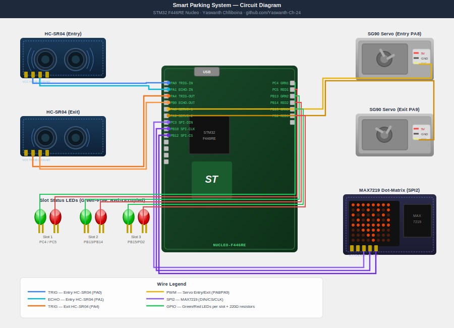

# Smart Parking Lot Management and Dynamic Guidance System

> **STM32 F446RE (Nucleo-F446RE) | Embedded C | HAL Library | 2026**
> Ultrasonic vehicle detection + PWM servo gate control + SPI MAX7219 dot-matrix display — real-time parking slot guidance on STM32 F446RE.

---

## 📌 Board: STM32 F446RE (Nucleo-F446RE)

| Detail | Value |
|---|---|
| MCU | STM32F446RET6 |
| Core | ARM Cortex-M4 @ 180 MHz |
| Flash | 512 KB |
| RAM | 128 KB SRAM |
| Board | NUCLEO-F446RE |
| IDE | STM32CubeIDE 1.14+ |
| HAL | STM32 HAL |
| Debugger | ST-Link V2 (on-board) |

---

## 🔍 Project Overview

A **smart parking infrastructure system** on the STM32 F446RE that detects vehicles at entry/exit using ultrasonic sensors (HC-SR04), controls automated gates using a PWM servo motor (SG90), and displays real-time parking slot availability on a MAX7219 dot-matrix display over SPI. All logic runs on the Nucleo board with real-time UART logging.

---

## ⚡ Features

| Feature | Hardware | STM32 Interface |
|---|---|---|
| Entry Vehicle Detection | HC-SR04 Ultrasonic | GPIO (TIM2 for timing) |
| Exit Vehicle Detection | HC-SR04 Ultrasonic | GPIO (TIM3 for timing) |
| Entry Gate Control | SG90 Servo | TIM1 CH1 (PWM) |
| Exit Gate Control | SG90 Servo | TIM1 CH2 (PWM) |
| Slot Display | MAX7219 Dot-Matrix | SPI2 |
| Slot LEDs (per bay) | 6x Red/Green LEDs | GPIO Output |
| Debug Terminal | USB-UART | USART1 (ST-Link) |

---

## 🔌 Pin Connections (STM32 F446RE Nucleo)

### HC-SR04 Entry Ultrasonic — GPIO + TIM2

| HC-SR04 Pin | STM32 Pin | Nucleo Label |
|---|---|---|
| TRIG | PA0 | CN7-28 (Arduino A0) |
| ECHO | PA1 | CN7-30 (Arduino A1) |
| VCC | 5V | CN6-5 |
| GND | GND | CN6-6 |

### HC-SR04 Exit Ultrasonic — GPIO + TIM3

| HC-SR04 Pin | STM32 Pin | Nucleo Label |
|---|---|---|
| TRIG | PA4 | CN7-32 (Arduino A2) |
| ECHO | PB0 | CN10-31 (Arduino A3) |
| VCC | 5V | CN6-5 |
| GND | GND | CN6-6 |

### SG90 Servo Motors — TIM1 PWM

| Servo | STM32 Pin | Nucleo Label | Function |
|---|---|---|---|
| Entry Gate | PA8 | CN10-23 (Arduino D7) | TIM1 CH1 |
| Exit Gate | PA9 | CN10-21 (Arduino D8) | TIM1 CH2 |
| VCC (both) | 5V | CN6-5 | |
| GND (both) | GND | CN6-6 | |

Servo signal: 50Hz PWM. 1ms pulse = 0 degrees (closed), 2ms pulse = 90 degrees (open).

### MAX7219 Dot-Matrix Display — SPI2

| MAX7219 Pin | STM32 Pin | Nucleo Label |
|---|---|---|
| DIN | PC3 | CN7-37 |
| CLK | PB10 | CN10-25 |
| CS (LOAD) | PB12 | CN10-16 |
| VCC | 5V | CN6-5 |
| GND | GND | CN6-6 |

### Slot Status LEDs — GPIO Output

| LED | STM32 Pin | Nucleo Label | Meaning |
|---|---|---|---|
| Slot 1 Green | PC4 | CN7-34 | Free |
| Slot 1 Red | PC5 | CN10-6 | Occupied |
| Slot 2 Green | PB13 | CN10-30 | Free |
| Slot 2 Red | PB14 | CN10-28 | Occupied |
| Slot 3 Green | PB15 | CN10-26 | Free |
| Slot 3 Red | PD2 | CN7-20 | Occupied |

---

## 🔌 Circuit Diagram



> Full wiring guide in [docs/quick_start.md](docs/quick_start.md)

## 📁 Repository Structure

```text
smart-parking-system/
├── Core/
│   ├── Inc/
│   │   ├── main.h
│   │   ├── hcsr04.h
│   │   ├── servo.h
│   │   ├── max7219.h
│   │   └── parking.h
│   └── Src/
│       ├── main.c
│       ├── hcsr04.c
│       ├── servo.c
│       ├── max7219.c
│       └── parking.c
├── simulator/
│   └── simulate.py
└── README.md
```

---

## 🚀 How to Run

### Option A — Simulate on PC (No hardware needed)

```bash
cd simulator
python simulate.py
```

### Option B — Flash to STM32 F446RE Nucleo

1. Install **STM32CubeIDE**
2. Import project, connect Nucleo via USB, click Run
3. Open Serial Monitor at **115200 baud**

---

## 📊 Sample Output (UART Terminal @ 115200 baud)

```text
=========================================
  Smart Parking System
  STM32 F446RE | Yaswanth Chlliboina
=========================================
[INIT] Total slots: 3 | Available: 3

[ENTRY] Vehicle detected at entry (dist=8cm)
[GATE]  Entry gate OPENING (servo 90deg)
[SLOT]  Slot 1 assigned >> Red LED ON
[COUNT] Available: 2
[GATE]  Entry gate CLOSING (servo 0deg)

[EXIT]  Vehicle detected at exit (dist=7cm)
[GATE]  Exit gate OPENING
[SLOT]  Slot 1 released >> Green LED ON
[COUNT] Available: 3
[GATE]  Exit gate CLOSING

[FULL]  Parking FULL - Entry gate locked
```

---

## 👤 Author

Chlliboina Yaswanth

B.Tech Electrical and Electronics Engineering | CGPA: 8.56

Dr. Lankapalli Bullayya College of Engineering, Visakhapatnam

- Email: [yaswanth2452005@gmail.com](mailto:yaswanth2452005@gmail.com)
- LinkedIn: [yaswanth-chlliboina](https://www.linkedin.com/in/yaswanth-chlliboina/)
- GitHub: [Yaswanth-Ch-24](https://github.com/Yaswanth-Ch-24)
